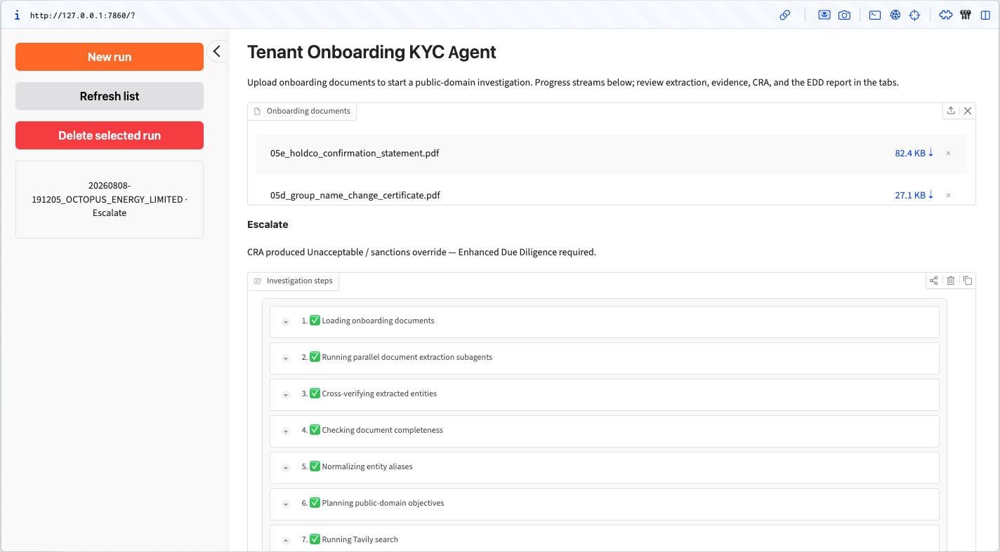
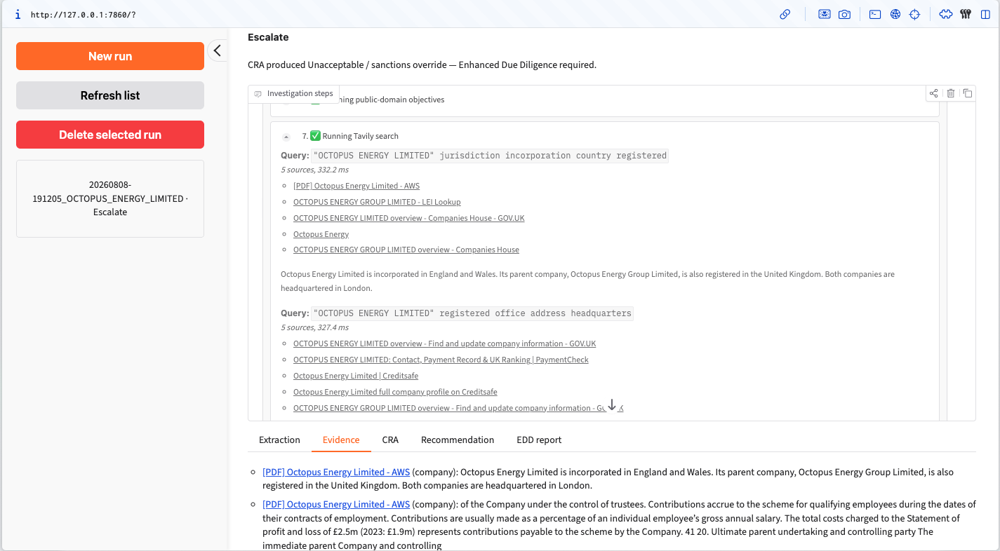
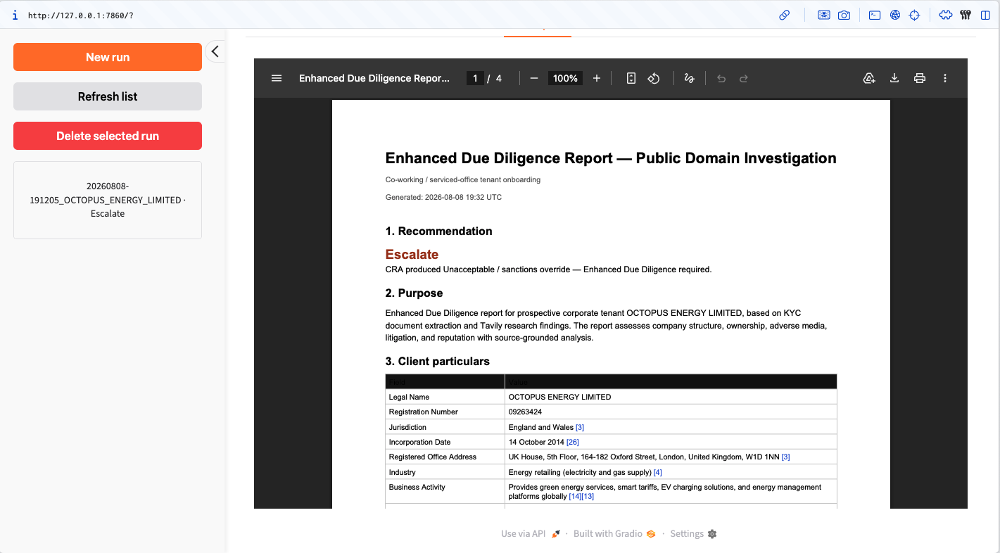
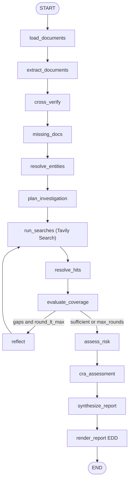

# Tavily-Powered Automated KYC and Investigation Agent

**Demo:** [Screen recording](https://cleanshot.com/share/b8lcmkGK)

**Session logs:** [session_logs.txt](session_logs.txt)

**OCR Extraction does take a while !!!**

## Screenshots



*Upload documents, stream investigation steps, and review completed runs in the sidebar.*



*Evidence tab showing Tavily search queries, sources, and corroborated public-domain findings.*



*Generated Enhanced Due Diligence PDF report with recommendation and client particulars.*

Tavily-powered **adaptive** public-domain / adverse-media investigation for co-working / serviced-office tenant KYC onboarding for a Commercial Real Estate firm.

This is a LangGraph workflow that plans focused search queries, gathers structured evidence via the **Tavily Search API**, runs a deterministic **Client Risk Assessment (CRA)**, and produces an **Enhanced Due Diligence** report with a citations appendix. Advisory only (`Proceed` | `Review` | `Escalate`).

## What it does

- Document intake (file uploads)
- Cross-verification entity spine
- Missing-document checklist
- Parallel Tavily Search (public-domain)
- Adverse hit resolution
- CRA matrix scoring + EDD PDF report

This app improves the **manual web investigation** slice.

## Setup

```bash
# Python 3.11+
uv sync
uv pip install -e .

# Required keys in .env
cp .env.example .env
# TAVILY_API_KEY=tvly-...
# NEBIUS_API_KEY=...
```

**Cheaper models (default):** set `NEBIUS_COST_PROFILE=budget` in `.env` (this is the default if unset). That uses **Qwen3-30B-A3B** for structured extraction and **MiniCPM-V-4.5** for fast scanned PDF/image OCR. Use `balanced` or `quality` for stronger (pricier) text models; override with `NEBIUS_MODEL` / `NEBIUS_VISION_MODEL` anytime.

**Tavily:** public-domain retrieval uses Tavily Search only (`search_depth=advanced`, up to 5 results per query).

## Run

```bash
uv run kyc-investigate
# or: uv run kyc-investigate --log-level DEBUG
```

Open [http://127.0.0.1:7860](http://127.0.0.1:7860). Upload onboarding files — the investigation starts automatically. Progress streams in the step panel; **the same events also print in your terminal**. Results appear in the tabs below. Completed runs save artifacts under `artifacts/runs/`.

**Scanned PDFs:** if a PDF has no text layer, pages are rasterized and sent to the vision model (`NEBIUS_VISION_MODEL`, default **MiniCPM-V-4.5** for OCR latency). Override with `NEBIUS_VISION_MODEL` if needed.

## Tests

```bash
uv run pytest -q
```

## Architecture

See [SUBMISSION_TECHNICAL_STATEMENT.md](SUBMISSION_TECHNICAL_STATEMENT.md).


