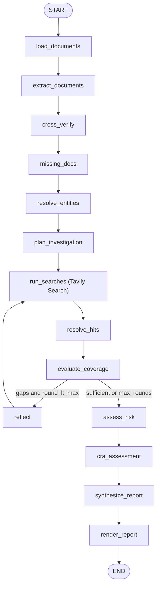

# Technical statement

## Use case

Commercial real estate firms must complete KYC/due diligence before onboarding corporate tenants. Compliance teams already collect documents, run sanctions/PEP screening (e.g. WorldCheck), check registers, and score customer risk. The slow, inconsistent part is often the **manual public-domain investigation**: searching for adverse media, litigation, reputation, and ownership corroboration across the open web, then citing sources for an analyst decision.

## Approach

We built a LangGraph-Tavily powered KYC and due diligence agent that treats Tavily as an iterative retrieval system:

1. Load onboarding documents from analyst uploads or a sample pack.
2. Extract company, signatories, and ownership signals from the documents using LLM + OCR.
3. **LLM cross-verification** reads all documents and extracts company, signatories, and ownership signals — including shareholding percentages and control persons.
4. Check mandatory document gaps and emit a document-request list (always includes UBO declaration).
5. Plan **focused** searches from investigation objectives (not one broad query), including screens for document-extracted ownership candidates and corporate shareholders.
6. Run **Tavily Search** tasks in parallel.
7. Store structured `Evidence` objects (claim, confidence, URL, date, provenance).
8. Resolve adverse vs irrelevant hits; evaluate coverage and optionally reflect into more searches.
9. Run a deterministic **Client Risk Assessment (CRA)** using matrix lookup tables (geography, customer, delivery, screening, product/service).
10. Emit an **Enhanced Due Diligence** Markdown report with CRA summary and **Appendix A citations**. Recommendation is advisory only.

A UI lets analysts attach files, stream LangGraph task progress, inspect CRA JSON, and open the EDD PDF report in a side panel (with download).

## Business / technical value

- **Time**: parallel objective-driven search + one reflection pass replaces ad-hoc analyst browsing.
- **Quality**: evidence-first architecture with URLs, dates, and confidence on findings.
- **Trust**: visible Tavily lifecycle (queries, params, latency, sources) without exposing credentials.

## Stack

Python, LangGraph, Nebius chat model for extraction/resolution, Tavily Search API, Gradio UI.

## Technical details

## Technical approach

### LangGraph investigation agent

I built the KYC investigation as a **stateful LangGraph agent** rather than a single LLM call with a search tool.

The graph represents the investigation as a series of stages:

**KYC documents → entity extraction → cross-verification → investigation planning → Tavily research → evidence evaluation → follow-up research → risk assessment → EDD report**

Each stage builds on the output of the previous stage. The agent maintains a shared investigation state containing the extracted entities, ownership information, document gaps, research objectives, evidence, and investigation coverage.

This gives the agent a structured way to reason about the investigation without putting the entire workflow into a single prompt.

### Planning and research

After extracting the KYC information, the agent first determines **what needs to be investigated**.

For example, if the submitted documents establish the company but leave the ultimate ownership structure unclear, the investigation planner creates an ownership/UBO research objective. If a director is identified in the documents, the agent can create separate objectives for that individual rather than simply searching for the company as a whole.

These objectives are then translated into focused Tavily searches.

This separation between **planning and retrieval** was intentional: it means Tavily is being used to answer specific investigation questions generated from the KYC context, rather than acting as a generic web-search chatbot.

### Iterative investigation loop

One of the main reasons I used LangGraph was to support an iterative investigation loop.

After the first round of searches, the agent evaluates the evidence it has collected against the original investigation objectives. If important gaps remain, the graph branches back into the research stage and generates additional searches.

For example:

**Initial documents**
→ ownership appears incomplete

**Round 1**
→ Tavily finds a parent company

**Coverage evaluation**
→ parent company's ownership is still unresolved

**Round 2**
→ agent searches the newly discovered entity

**Final evidence**
→ ownership chain can now be represented in the EDD report

The number of research rounds is deliberately bounded so that the agent remains predictable in terms of latency and Tavily usage.

### Evidence and source grounding

Tavily results are converted into structured evidence as they enter the investigation state. The agent keeps track of which investigation objective each piece of evidence relates to, allowing the final report to distinguish between different types of findings.

The Tavily-generated answer is treated as **research guidance rather than evidence itself**. The underlying source pages returned by Tavily are what ultimately support claims in the EDD report.

This also allows the application to expose the research process to the user: they can see what was searched, which sources were found, and how those sources contributed to the investigation.

### Why LangGraph

The main benefit of LangGraph here is that the workflow has real state and conditional paths.

Allowing:

**documents → identify gaps → investigate → evaluate coverage → investigate again if necessary → synthesize**

That is much closer to how a human analyst actually performs an EDD investigation and makes the system capable of adapting its research based on what it discovers. 

Used gradio for this POC for the UI.

### Tavily usage

We use Tavily Search only (no Research API). All calls go through TracedTavilyClient:

One search per investigation objective — queries are narrow and entity-scoped (company profile, litigation, adverse media, ownership inference, director screens), not a single catch-all prompt.
Parameters: search_depth=advanced, max_results=5, include_answer=True, topic ∈ {general, news, finance} per objective.
Parallelism: search_many runs queries concurrently (thread pool).
Evidence normalisation: each result becomes a typed Evidence record (claim, confidence, URL, published date, category, provenance, adverse flag, objective_id).
Tracing: every call appends a TavilyTrace (query, params, latency, answer snippet, source list). Secrets are redacted before logging or UI display.
Loop: reflect turns coverage gaps into additional pending_queries for a second search round when budget allows.

Tavily answers/snippets are inputs to investigation, not cited as independent sources — the underlying result URLs are the evidence.

### Nebius usage

Use chat models for extraction/resolution/analysis/report generation.
Use vision models for OCR.

### Agent DAG

