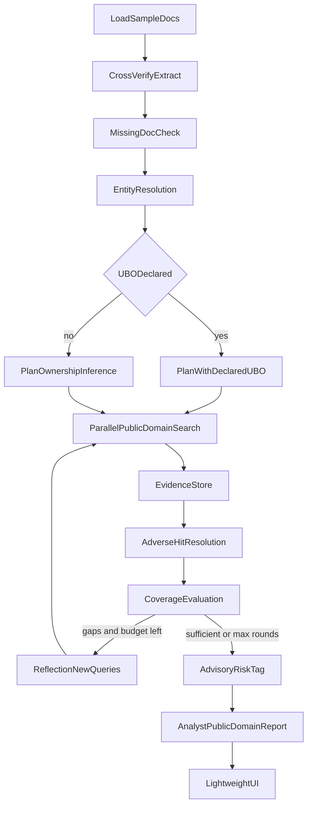

# KYC Investigation Agent (LangGraph + Tavily + light UI)

## Context

Take-home **Option 1** ([2606_Tavily_FDE_TakeHomeAssignment.md](2606_Tavily_FDE_TakeHomeAssignment.md)): meaningfully improve [`starter_agent.py`](starter_agent.py) for a real workflow. Spec is [`kyc_blueprint.md`](kyc_blueprint.md).

**Customer:** co-working / serviced-office operator onboarding corporate tenants. Compliance already runs document intake, WorldCheck/PEP screening, register checks, CRA scoring, and EDD/clearance report generation. This project improves the **manual public-domain / adverse-media investigation** slice with Tavily — not a full compliance platform clone.

**Default scope (4–6h fit):** investigation engine + light UI; 1 reflection pass max; no DB/auth/dashboard. Primary demo claim: *adaptive retrieval*, not a chatbot.

Do **not** ship [`starter_agent.py`](starter_agent.py). Keep Nebius + `TAVILY_API_KEY` from `.env`.

## Where this sits in the real onboarding pipeline

Borrow framing from the full Compliance Client Onboarding workflow; implement only the bolded pieces:

```text
Client Files
  └─► Cross-verification spine (entity + signatories/UBOs, inconsistency flags)   ← thin
  └─► Missing document check → document request list                            ← thin
  └─► WorldCheck / LSEG screening                                               ← OUT
  └─► Official register API (e.g. ADGM)                                         ← OUT
  └─► Public domain / adverse media                                             ← CORE (Tavily)
        Search plan → parallel runs → evidence → hit resolution → report
  └─► Full CRA matrix / DOCX / Excel workbook                                   ← OUT
  └─► EDD DOCX / Clearance markdown product artifacts                           ← OUT (we emit advisory Proceed|Review|Escalate)
  └─► Compliance Tracker Excel                                                  ← OUT
```

Technical statement should say explicitly: Tavily replaces the analyst’s iterative web investigation; sanctions providers and CRA tooling remain separate.

## Architecture



**State** (`InvestigationState`): documents present/missing, entities (with `ubo_status`), inconsistency flags, objectives, evidence[], adverse_resolutions[], coverage, pending_queries[], timeline, tavily_traces[], recommendation, report.

**Nodes:**

| Node | Role |
|------|------|
| `load_documents` | Read sample KYC docs (text mocks, not OCR) |
| `cross_verify` | Extract screening subjects: entity, signatories, UBOs if present; flag field inconsistencies |
| `missing_docs` | Check mandatory set; emit document-request list |
| `resolve_entities` | Normalize aliases; set `ubo_status` |
| `plan_investigation` | Targeted public-domain queries from identity/sector/flags; UBO branch |
| `run_searches` | Concurrent Tavily searches → structured `Evidence` + traces |
| `resolve_hits` | Classify adverse vs irrelevant (LLM); keep only genuine hits for risk |
| `evaluate_coverage` | Score objectives; ownership gaps when UBO absent/inferred |
| `reflect` | Gaps → new Tavily queries only |
| `assess_risk` | Advisory `Proceed` / `Review` / `Escalate` (not a CRA workbook score) |
| `render_report` | Public-domain investigation report + coverage + missing docs + next manual actions |

Loop: coverage → reflect → search until threshold **or** `max_rounds=2`.

## UBO handling (declared vs found)

Default pack has **no** UBO declaration — realistic intake gap.

| Situation | Behavior |
|-----------|----------|
| **Declared** | Investigate named UBO(s); corroborate publicly; label `document_declared` vs `public_corroboration` |
| **Absent** | Ownership-inference searches only; candidates `provenance=inferred`; never verified fact |
| **Inferred only** | Coverage incomplete; document request includes UBO/ownership docs; bias toward `Review`/`Escalate` |

```python
ubo_status: Literal["declared", "absent", "inferred"]
```

## Missing documents (lightweight)

Mandatory checklist inspired by real intake (subset only):

- `kyc_form`, `trade_licence` / `commercial_license` or `certificate_of_incorporation`
- `register_of_shareholders` or `shareholding_structure` / `group_structure_chart`
- Passport or national ID for each signatory; UBO identity if UBO declared

Absent items → UI “Document request” list (e.g. request UBO declaration). No email/workflow integration.

## Tavily integration

- **`tavily` Python SDK**; every search: `include_answer="advanced"`, focused queries, `client_name`
- Adverse media: `topic="news"`; company/ownership: `topic="general"`
- Selective extract only for high-value corroboration URLs
- Dedupe by `(url, claim_hash)`; never expose API keys
- Install Tavily Skills; short Tavily section in [`AGENTS.md`](AGENTS.md)

## Evidence schema

```python
class Evidence(BaseModel):
    entity: str
    category: str  # company | ubo | adverse_media | litigation | reputation | ownership
    claim: str
    confidence: float
    source: str
    published_date: str | None
    url: str
    provenance: str | None  # document_declared | public_corroboration | inferred
    adverse: bool | None    # set after hit resolution
```

## Sample packs

Fictional corporate **serviced-office / co-working tenant**:

`samples/acme_holdings/` (default — no UBO):

- `kyc_form`, `trade_licence`, `certificate_of_incorporation`
- Partial `register_of_shareholders` (incomplete ownership)
- Signatory passport metadata
- **No** UBO declaration / group structure chart

`samples/acme_holdings_with_ubo/` (tests + UI toggle):

- Same plus UBO identity + ownership chart excerpt

Doc filenames/labels align with real `DOC_TYPE_TO_LABEL` keys where useful (trade_licence, certificate_of_incorporation, etc.).

## Super-lightweight UI

FastAPI + one HTML page + minimal CSS. No React/SPA, no auth, no DB.

1. Brand/header: co-working KYC public-domain investigation
2. Pack select (default / with-UBO) + **Run**
3. Live timeline (SSE or poll)
4. Panels: missing docs, entities/UBO status, recommendation, coverage %, report, expandable Tavily traces

Optional CLI: `uv run kyc-investigate --cli`. Default: serve `http://127.0.0.1:8000`.

## File layout

```
kyc_agent/
  cli.py, app.py, templates/index.html, static/app.css
  state.py, graph.py, tavily_client.py, display.py
  nodes/  # documents, cross_verify, missing_docs, entities, planner,
          # search, resolve_hits, coverage, reflect, assess, report
samples/acme_holdings/
samples/acme_holdings_with_ubo/
tests/
AGENTS.md, README.md, TECHNICAL_STATEMENT.md
```

[`pyproject.toml`](pyproject.toml): `fastapi`, `uvicorn`, `langgraph`, `langchain-nebius`, `tavily-python`, `typer`, `rich`, `python-dotenv`, `pydantic`, `jinja2`.

## Tests & live verification

- Declared vs absent UBO planner; inferred never labeled verified
- Missing-doc list when UBO/ownership docs absent
- Adverse vs irrelevant resolution shapes recommendation
- Mocked Tavily graph path; credential redaction
- Live UI run on default pack: follow-ups, uncertain ownership, document request, cited report

## Deliverables

- Runnable light UI (+ optional CLI); no `starter_agent.py`
- Technical statement: Tavily as adaptive public-domain engine inside co-working KYC; what we deliberately did not rebuild
- README + build-session note
